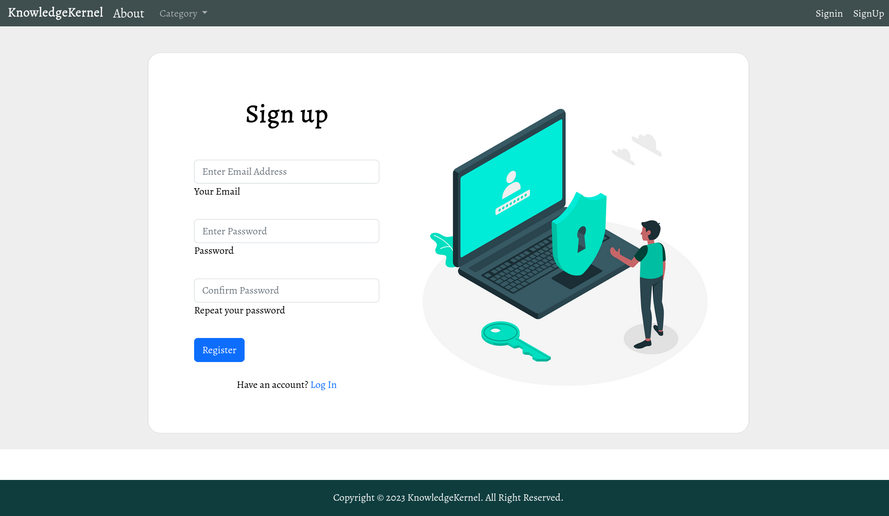
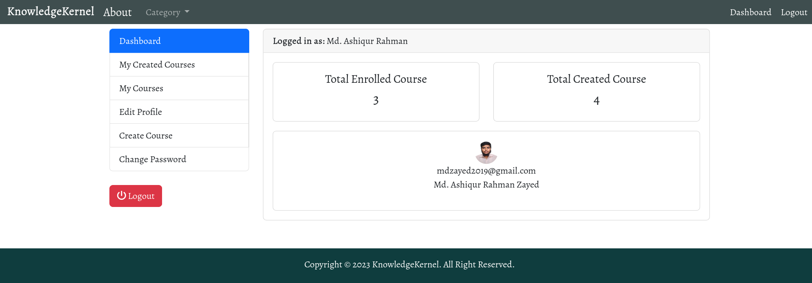
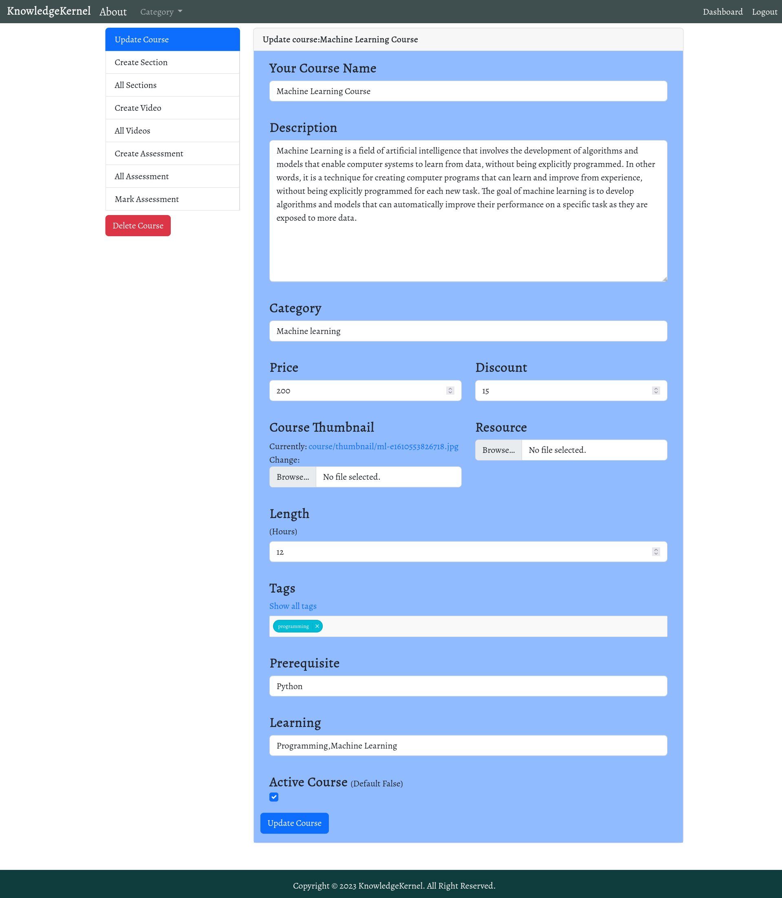
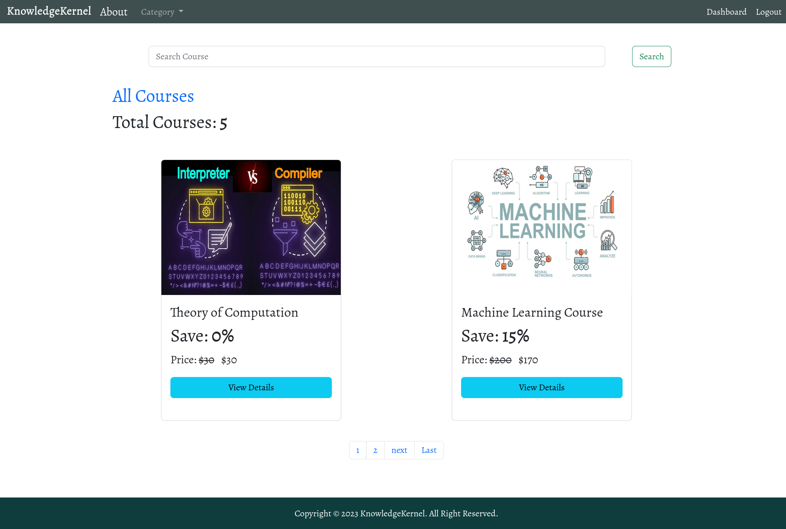
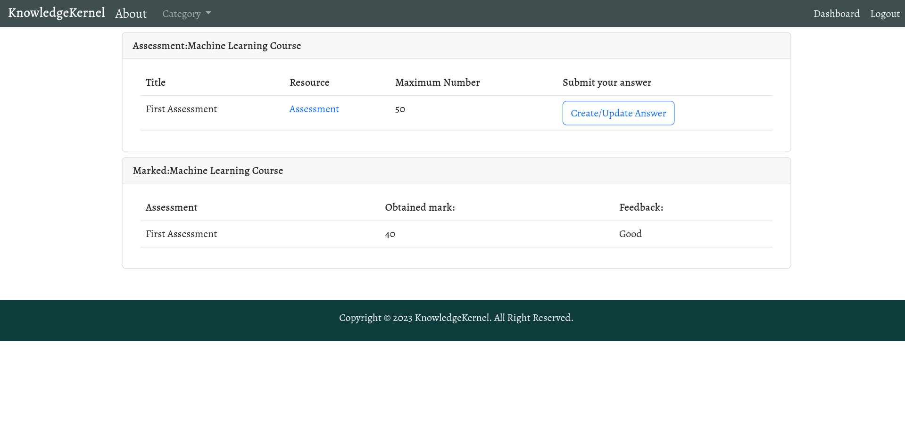

# KnowledgeKernel
Knowledge-Kernel is an e-learning website through which the students will get the opportunity to acquire their skills in various subjects. Our goal is that students come to an e-learning community to learn and teach others.

<br>
NB:<br>
1.Sign up need gmail verification.So You have to create a info.py in KnowledgeKernel folder and fill it just like info-demo.py.After sign in you need to complete your profile for creating course and enrolling course.<br>
2.Only Youtube video are allowed.<br>
3.if youtube video link is https://www.youtube.com/watch?v=66LP3XPv-nQ then  Video id will be 66LP3XPv-nQ .<br>
4.In Assignment section only pdf drive link can be shared.no need uploaded.<br>
5.payment need sendbox sslcommerz.Create account and configure it info.py<br>

## Setup


The first thing is cloneing the repository:


```sh
$ git clone https://github.com/MdAshiqurRahmanZayed/KnowledgeKernel.git
$ cd KnowledgeKernel
```
Create a virtual environment to install dependencies in and activate it:

```sh
$ python -m venv test
$ source test/bin/activate
```
Then install the dependencies:

```sh
(test)$ pip install -r requirements.txt
```

we have to migrate.
```sh
$ python manage.py makemigrations 
$ python manage.py migrate 
$ python manage.py createsuperuser
```
Create info.py in KnowledgeKernel just like info-demo.py<br>

```sh
(test)$ python manage.py runserver
```
And navigate to `http://127.0.0.1:8000/`


Demo Screenshots:







